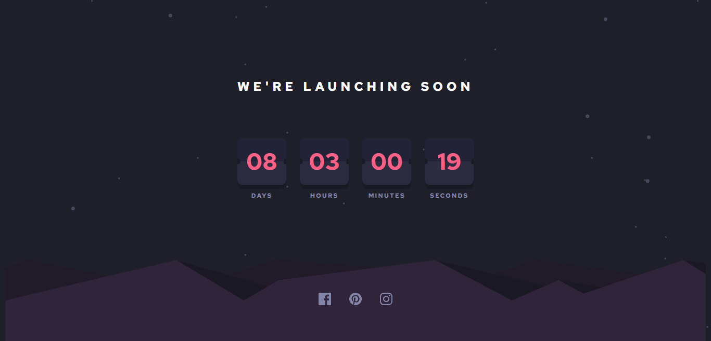

# Frontend Mentor - Launch countdown timer solution

<!-- screenshots here -->

A challenge from [frontendmentor.io](https://www.frontendmentor.io/)

## Overview

### Links

- [Live Site](https://your-live-site-url.com)
- [Solution](https://your-solution-url.com)

### The challenge

Users should be able to:

- View the optimal layout for the site depending on their device's screen size
- See hover states for all interactive elements on the page
- Create the background shape using code

## My process

### Built with

- HTML
- CSS
- Vanilla Javascript

### What I learned

Frontendmentor really teach me a lot. On every challenge, there are always something new to learn. I got some difficulities while doing this challenge to make the flip animation. Luckily, I found a youtube videos that shows me the concept behind it. And I learn a lot, at first it was really hard, but at the end, I can understand what is going on.

### Useful Resources

1. [Figma](https://www.figma.com/) - Paste your project design mockups to check the size, colors, etc.
2. [flip clock animation tutorial by FrontEndFunn](https://www.youtube.com/watch?v=ImuDIR3AbIs&t=1s) - Helps me alot for making flip animation

## Acknowledgments

Thank you very much to everyone who gave me feedback on my solution. It greatly assists me in improving my frontend development skills.
